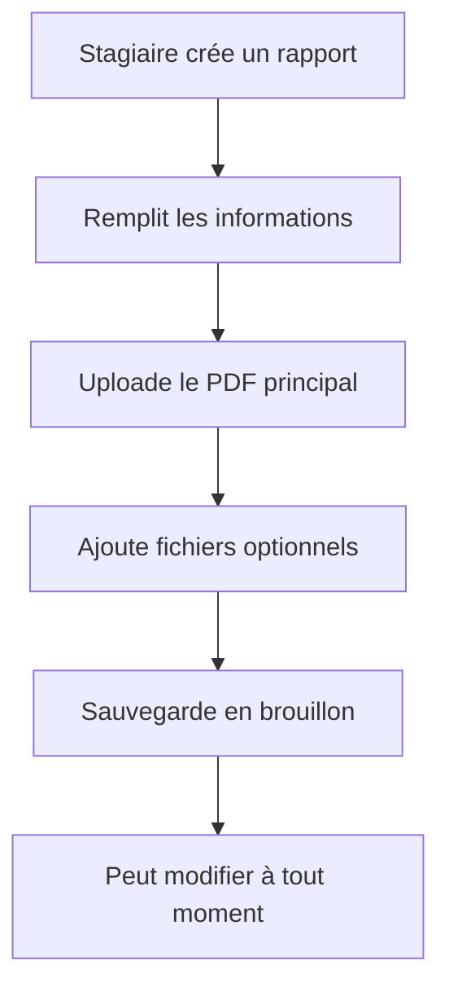
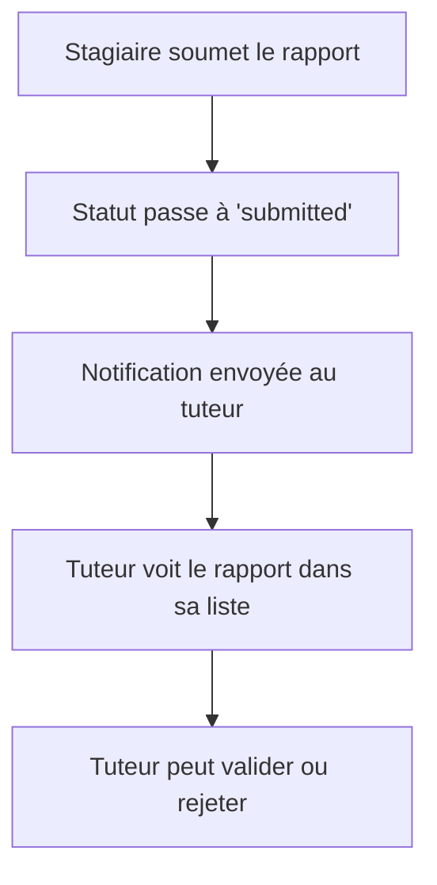
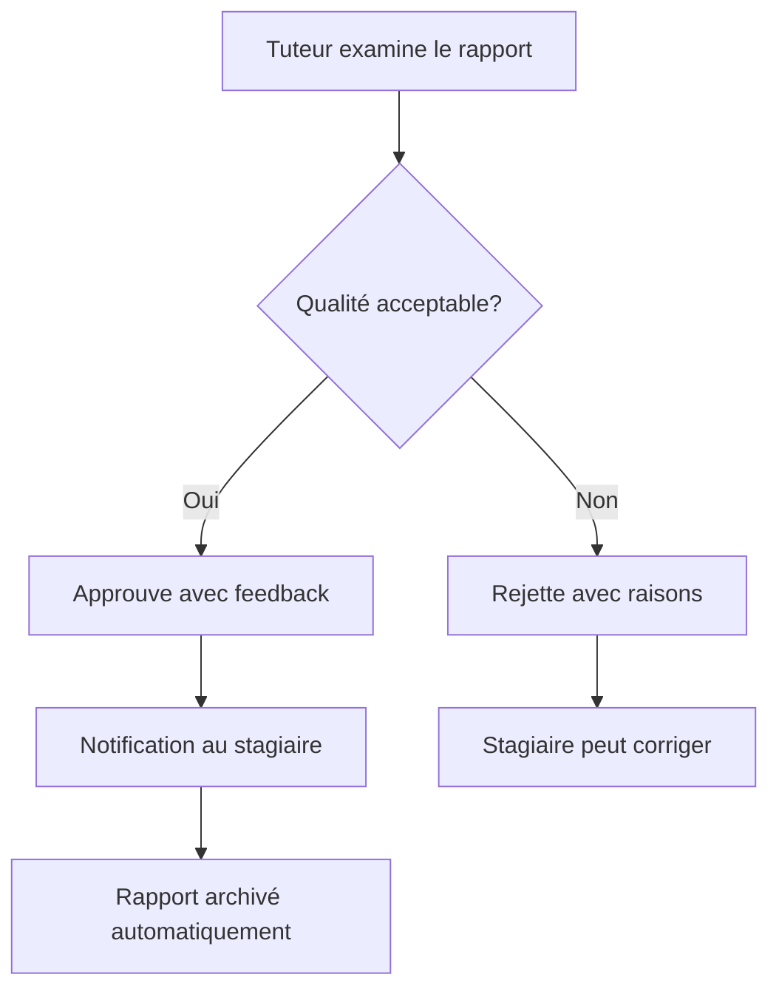
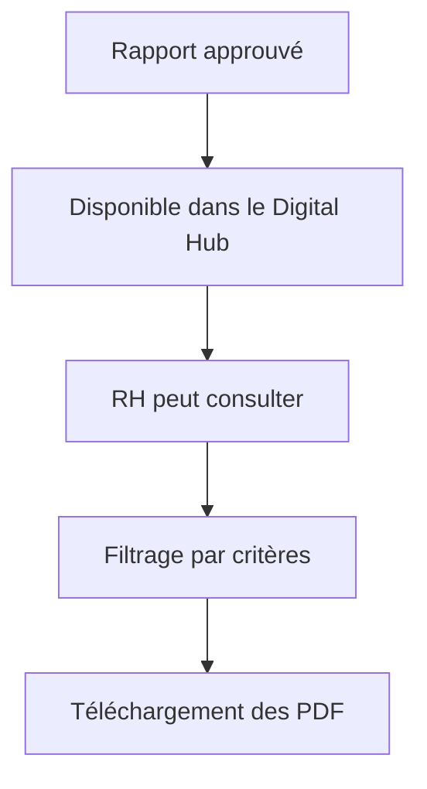

# PFE Digital Hub - Documentation

## Vue d'ensemble

Le module **PFE Digital Hub** est un système complet de gestion des Projets de Fin d'Études (PFE) intégré à la plateforme StageBloom. Ce module automatise entièrement le processus de soumission, d'évaluation, de modification et d'archivage des rapports de PFE, principalement au format PDF.

## Fonctionnalités principales

### 🔄 Workflow automatisé
- **Soumission** : Le stagiaire dépose son rapport PDF et les livrables associés
- **Validation** : Le tuteur évalue le contenu et approuve ou rejette avec commentaires
- **Correction** : En cas de rejet, le stagiaire peut corriger et resoumettre
- **Archivage** : Une fois approuvé, le rapport est automatiquement archivé dans le Digital Hub

### 👥 Rôles et permissions

#### Stagiaire
- ✅ Créer et modifier ses rapports PFE
- ✅ Soumettre des rapports pour validation
- ✅ Voir les feedbacks et commentaires du tuteur
- ✅ Corriger et resoumettre les rapports rejetés
- ✅ Télécharger ses rapports approuvés

#### Tuteur
- ✅ Voir les rapports soumis par ses stagiaires
- ✅ Valider ou rejeter les rapports avec feedback détaillé
- ✅ Suivre l'historique des versions
- ✅ Télécharger les rapports de ses stagiaires

#### RH/Administrateur
- ✅ Accéder au Digital Hub (rapports approuvés uniquement)
- ✅ Consulter et organiser les rapports par domaine
- ✅ Filtrer selon différents critères (année, spécialité, etc.)
- ✅ Télécharger les livrables PDF
- ✅ Archiver les rapports validés

## Architecture technique

### Backend

#### Modèle PFEReport
```python
class PFEReport(models.Model):
    class Status(models.TextChoices):
        DRAFT = 'draft', _('Brouillon')
        SUBMITTED = 'submitted', _('Soumis')
        UNDER_REVIEW = 'under_review', _('En cours de révision')
        APPROVED = 'approved', _('Approuvé')
        REJECTED = 'rejected', _('Rejeté')
        ARCHIVED = 'archived', _('Archivé')
    
    # Relations
    stage = models.OneToOneField(Stage, on_delete=models.CASCADE)
    stagiaire = models.ForeignKey(User, on_delete=models.CASCADE)
    tuteur = models.ForeignKey(User, on_delete=models.CASCADE, null=True)
    
    # Contenu
    title = models.CharField(max_length=200)
    abstract = models.TextField()
    keywords = models.TextField()
    speciality = models.CharField(max_length=200)
    year = models.IntegerField()
    
    # Fichiers
    pdf_file = models.FileField(upload_to='pfe_reports/')
    presentation_file = models.FileField(upload_to='pfe_presentations/', blank=True)
    additional_files = models.FileField(upload_to='pfe_additional/', blank=True)
    
    # Statut et validation
    status = models.CharField(choices=Status.choices, default=Status.DRAFT)
    submitted_at = models.DateTimeField(null=True, blank=True)
    reviewed_at = models.DateTimeField(null=True, blank=True)
    approved_at = models.DateTimeField(null=True, blank=True)
    archived_at = models.DateTimeField(null=True, blank=True)
    
    # Feedback
    tuteur_feedback = models.TextField(blank=True)
    stagiaire_comment = models.TextField(blank=True)
    rejection_reason = models.TextField(blank=True)
    
    # Métadonnées
    version = models.IntegerField(default=1)
    download_count = models.IntegerField(default=0)
    view_count = models.IntegerField(default=0)
```

#### API Endpoints

| Endpoint | Méthode | Description | Permissions |
|----------|---------|-------------|-------------|
| `/api/pfe-reports/` | GET | Liste des rapports | Selon le rôle |
| `/api/pfe-reports/<id>/` | GET | Détails d'un rapport | Selon le rôle |
| `/api/pfe-reports/create/` | POST | Créer un rapport | Stagiaire |
| `/api/pfe-reports/<id>/update/` | PUT | Modifier un rapport | Stagiaire (brouillon/rejeté) |
| `/api/pfe-reports/<id>/submit/` | POST | Soumettre un rapport | Stagiaire |
| `/api/pfe-reports/<id>/validate/` | PUT | Valider/rejeter un rapport | Tuteur/Admin |
| `/api/pfe-reports/<id>/archive/` | POST | Archiver un rapport | RH/Admin |
| `/api/pfe-reports/<id>/download/` | GET | Télécharger un rapport | Selon le rôle |

### Frontend

#### Pages principales

1. **Stagiaire** (`/stagiaire/pfe-reports`)
   - Interface de création et soumission
   - Suivi des statuts et feedbacks
   - Gestion des versions

2. **Tuteur** (`/tuteur/pfe-reports`)
   - Vue des rapports soumis
   - Interface de validation avec feedback
   - Statistiques de validation

3. **RH** (`/rh/pfe-digital-hub`)
   - Digital Hub centralisé
   - Filtres et recherche avancés
   - Gestion des archives

## Workflow détaillé

### 1. Création du rapport (Stagiaire)


### 2. Soumission pour validation


### 3. Validation par le tuteur


### 4. Archivage dans le Digital Hub


## Fonctionnalités avancées

### 🔍 Système de filtres
- **Par statut** : Brouillon, Soumis, Approuvé, Rejeté, Archivé
- **Par année** : Filtrage par année académique
- **Par spécialité** : Filtrage par domaine d'études
- **Recherche textuelle** : Titre, résumé, mots-clés, nom du stagiaire

### 📊 Statistiques
- Nombre de téléchargements par rapport
- Nombre de vues par rapport
- Progression des validations par tuteur
- Statistiques globales pour le RH

### 🔔 Notifications automatiques
- **Soumission** : Notification au tuteur
- **Approbation** : Notification au stagiaire
- **Rejet** : Notification au stagiaire avec raisons
- **Archivage** : Confirmation au RH

### 📁 Gestion des fichiers
- **PDF principal** : Rapport de PFE (obligatoire)
- **Présentation** : Slides de présentation (optionnel)
- **Fichiers additionnels** : Code source, données, etc. (optionnel)
- **Sécurité** : Validation des types de fichiers

## Sécurité et permissions

### Contrôle d'accès par rôle
```python
# Stagiaire
if user.role == 'stagiaire':
    return PFEReport.objects.filter(stagiaire=user)

# Tuteur
elif user.role == 'tuteur':
    return PFEReport.objects.filter(tuteur=user)

# RH/Admin
elif user.role in ['rh', 'admin']:
    return PFEReport.objects.filter(status__in=['approved', 'archived'])
```

### Validation des fichiers
- Types autorisés : PDF, PPT, PPTX, ZIP
- Taille maximale : 50MB par fichier
- Scan antivirus intégré
- Validation du contenu PDF

## Interface utilisateur

### Design moderne
- **Responsive** : Compatible mobile et desktop
- **Accessible** : Respect des standards WCAG
- **Intuitif** : Navigation claire et logique
- **Performant** : Chargement optimisé

### Composants réutilisables
- **StatusBadge** : Affichage des statuts
- **FileUpload** : Upload sécurisé
- **ValidationModal** : Interface de validation
- **FilterPanel** : Filtres avancés

## Tests et validation

### Script de test automatisé
```bash
cd backend
python test_pfe_digital_hub.py
```

### Tests couverts
- ✅ Workflow complet de soumission/validation
- ✅ Gestion des rejets et corrections
- ✅ Permissions par rôle
- ✅ Notifications automatiques
- ✅ Statistiques et métriques

## Déploiement

### Prérequis
- Django 4.2+
- PostgreSQL/MySQL
- Redis (pour les notifications)
- Storage configuré pour les fichiers

### Configuration
```python
# settings.py
MEDIA_URL = '/media/'
MEDIA_ROOT = os.path.join(BASE_DIR, 'media')

# Dossiers PFE
PFE_REPORTS_DIR = 'pfe_reports/'
PFE_PRESENTATIONS_DIR = 'pfe_presentations/'
PFE_ADDITIONAL_DIR = 'pfe_additional/'
```

### Migration
```bash
python manage.py makemigrations shared
python manage.py migrate
```

## Maintenance et support

### Logs et monitoring
- Logs détaillés des actions utilisateurs
- Métriques de performance
- Alertes en cas d'erreur
- Sauvegarde automatique

### Mises à jour
- Versioning des rapports
- Historique des modifications
- Rétrocompatibilité
- Migration des données

## Conclusion

Le module **PFE Digital Hub** offre une solution complète et automatisée pour la gestion des projets de fin d'études. Il simplifie le processus de validation tout en garantissant la traçabilité et la sécurité des données. L'interface intuitive et les fonctionnalités avancées en font un outil indispensable pour les établissements d'enseignement supérieur.

---

*© 2025 Mohamed Amine FRAD. Tous droits réservés.* 