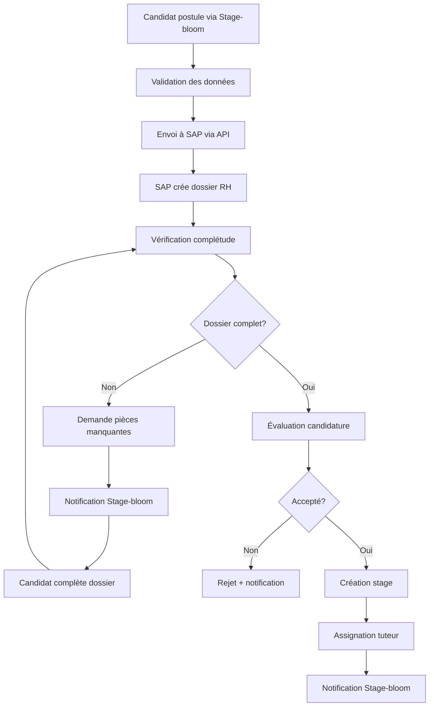

# Documentation d'Intégration SAP - Plateforme Stage-bloom

## 📋 Vue d'ensemble

Ce document décrit l'intégration entre le système SAP (pour la gestion RH et administrative) et la plateforme Stage-bloom (pour l'expérience utilisateur et la collecte des candidatures) selon le processus A1: Candidature & Intégration.

## 🏗️ Architecture d'Intégration

### Séparation des Responsabilités

```
┌─────────────────────────────────────────────────────────────────┐
│                    ARCHITECTURE D'INTÉGRATION                  │
├─────────────────────────────────────────────────────────────────┤
│                                                                 │
│  ┌─────────────────┐                    ┌─────────────────┐   │
│  │   PLATEFORME    │                    │      SAP        │   │
│  │   STAGE-BLOOM   │◄──────────────────►│   (SYSTÈME RH)  │   │
│  │                 │                    │                 │   │
│  │ • Formulaire    │                    │ • Gestion       │   │
│  │   candidature   │                    │   dossiers      │   │
│  │ • Interface     │                    │ • Vérification  │   │
│  │   utilisateur   │                    │   complétude    │   │
│  │ • Collecte      │                    │ • Évaluation    │   │
│  │   documents     │                    │   candidatures  │   │
│  │ • Notifications │                    │ • Workflow RH   │   │
│  └─────────────────┘                    └─────────────────┘   │
│                                                                 │
└─────────────────────────────────────────────────────────────────┘
```

## 🔄 Workflow d'Intégration

### 1. Processus de Candidature



### 2. Synchronisation des Données

| Étape | Stage-bloom | SAP | Synchronisation |
|-------|-------------|-----|-----------------|
| **Candidature** | Collecte formulaire | Création dossier | API POST |
| **Documents** | Upload fichiers | Stockage RH | API PUT |
| **Statut** | Affichage utilisateur | Gestion workflow | API GET |
| **Décision** | Notification | Validation RH | Webhook |
| **Stage** | Interface stagiaire | Création contrat | API POST |

## 🔌 Points d'Intégration Technique

### 1. APIs d'Intégration SAP

#### Endpoint de Création de Candidature
```http
POST /api/sap/candidatures/
Content-Type: application/json
Authorization: Bearer {sap_token}

{
  "candidat": {
    "nom": "string",
    "prenom": "string",
    "email": "string",
    "telephone": "string",
    "cv_url": "string",
    "lettre_motivation_url": "string"
  },
  "offre_stage": {
    "reference": "string",
    "titre": "string",
    "specialite": "string"
  },
  "documents": [
    {
      "type": "cv|lettre_motivation|diplome|autre",
      "url": "string",
      "nom_fichier": "string"
    }
  ]
}
```

#### Endpoint de Vérification de Statut
```http
GET /api/sap/candidatures/{id}/status/
Authorization: Bearer {sap_token}

Response:
{
  "id": "string",
  "statut": "en_attente|en_cours|complete|rejetee|acceptee",
  "etape": "verification|evaluation|decision|finalisee",
  "commentaires": "string",
  "date_modification": "datetime",
  "prochaines_actions": ["string"]
}
```

#### Endpoint de Mise à Jour de Statut
```http
PUT /api/sap/candidatures/{id}/status/
Authorization: Bearer {sap_token}

{
  "statut": "string",
  "etape": "string",
  "commentaires": "string",
  "decision": "acceptee|rejetee|en_attente",
  "raison_rejet": "string",
  "date_decision": "datetime"
}
```

### 2. Webhooks SAP → Stage-bloom

#### Configuration des Webhooks
```json
{
  "url": "https://stage-bloom.com/api/webhooks/sap/",
  "events": [
    "candidature.created",
    "candidature.updated",
    "candidature.status_changed",
    "candidature.approved",
    "candidature.rejected",
    "stage.created",
    "tuteur.assigned"
  ],
  "secret": "webhook_secret_key",
  "retry_policy": {
    "max_attempts": 3,
    "backoff_delay": 5000
  }
}
```

#### Structure des Webhooks
```json
{
  "event": "candidature.status_changed",
  "timestamp": "2025-01-27T10:30:00Z",
  "data": {
    "candidature_id": "string",
    "ancien_statut": "string",
    "nouveau_statut": "string",
    "utilisateur_sap": "string",
    "commentaires": "string"
  },
  "signature": "hmac_signature"
}
```

## 🗄️ Modèles de Données

### 1. Modèle de Candidature (Stage-bloom)
```python
class CandidatureSAP(models.Model):
    """Modèle de synchronisation avec SAP"""
    
    # Identifiants
    sap_id = models.CharField(max_length=100, unique=True)
    stage_bloom_id = models.CharField(max_length=100, unique=True)
    
    # Statut de synchronisation
    sync_status = models.CharField(
        max_length=20,
        choices=[
            ('pending', 'En attente'),
            ('syncing', 'Synchronisation'),
            ('synced', 'Synchronisé'),
            ('error', 'Erreur'),
            ('conflict', 'Conflit')
        ],
        default='pending'
    )
    
    # Données de candidature
    candidat_data = models.JSONField()
    offre_stage_data = models.JSONField()
    documents_data = models.JSONField()
    
    # Métadonnées SAP
    sap_created_at = models.DateTimeField()
    sap_updated_at = models.DateTimeField()
    sap_user = models.CharField(max_length=100)
    
    # Gestion des erreurs
    last_sync_error = models.TextField(blank=True)
    retry_count = models.IntegerField(default=0)
    
    # Timestamps
    created_at = models.DateTimeField(auto_now_add=True)
    updated_at = models.DateTimeField(auto_now=True)
    
    class Meta:
        db_table = 'candidature_sap'
        ordering = ['-created_at']
```

### 2. Modèle de Synchronisation
```python
class SAPSyncLog(models.Model):
    """Journal de synchronisation avec SAP"""
    
    candidature = models.ForeignKey(CandidatureSAP, on_delete=models.CASCADE)
    operation = models.CharField(max_length=50)  # create, update, delete
    direction = models.CharField(max_length=10)  # to_sap, from_sap
    
    # Données échangées
    request_data = models.JSONField()
    response_data = models.JSONField()
    
    # Statut
    success = models.BooleanField()
    error_message = models.TextField(blank=True)
    http_status = models.IntegerField()
    
    # Performance
    response_time_ms = models.IntegerField()
    
    # Timestamps
    created_at = models.DateTimeField(auto_now_add=True)
```

## 🔐 Sécurité et Authentification

### 1. Authentification SAP
```python
# Configuration d'authentification SAP
SAP_CONFIG = {
    'base_url': 'https://sap.company.com/api',
    'client_id': 'stage_bloom_client',
    'client_secret': 'secure_secret_key',
    'token_endpoint': '/oauth/token',
    'scope': 'candidatures:read candidatures:write',
    'certificate_path': '/path/to/client_cert.pem',
    'private_key_path': '/path/to/private_key.pem'
}
```

### 2. Gestion des Tokens
```python
class SAPTokenManager:
    """Gestionnaire de tokens d'authentification SAP"""
    
    def __init__(self):
        self.token = None
        self.expires_at = None
    
    def get_valid_token(self):
        """Récupère un token valide ou en demande un nouveau"""
        if self.token and self.expires_at > timezone.now():
            return self.token
        
        return self.refresh_token()
    
    def refresh_token(self):
        """Demande un nouveau token d'accès"""
        # Implémentation de la logique de refresh
        pass
```

## 📊 Monitoring et Observabilité

### 1. Métriques de Synchronisation
```python
class SAPSyncMetrics:
    """Métriques de performance de synchronisation"""
    
    def __init__(self):
        self.sync_success_count = 0
        self.sync_error_count = 0
        self.avg_response_time = 0
        self.last_sync_timestamp = None
    
    def record_sync_success(self, response_time):
        """Enregistre une synchronisation réussie"""
        self.sync_success_count += 1
        self.avg_response_time = self._calculate_avg(response_time)
        self.last_sync_timestamp = timezone.now()
    
    def record_sync_error(self, error_type):
        """Enregistre une erreur de synchronisation"""
        self.sync_error_count += 1
        # Log l'erreur pour analyse
```

### 2. Tableau de Bord de Synchronisation
```typescript
// Interface TypeScript pour le monitoring
interface SAPSyncDashboard {
  // Statistiques générales
  totalCandidatures: number;
  syncedCandidatures: number;
  pendingCandidatures: number;
  errorCandidatures: number;
  
  // Performance
  avgSyncTime: number;
  lastSyncTime: string;
  syncSuccessRate: number;
  
  // Erreurs récentes
  recentErrors: SAPSyncError[];
  
  // État des services
  sapConnectionStatus: 'connected' | 'disconnected' | 'error';
  webhookStatus: 'active' | 'inactive' | 'error';
}
```

## 🚀 Implémentation

### 1. Service d'Intégration SAP
```python
class SAPIntegrationService:
    """Service principal d'intégration avec SAP"""
    
    def __init__(self):
        self.token_manager = SAPTokenManager()
        self.metrics = SAPSyncMetrics()
    
    async def create_candidature(self, candidature_data):
        """Crée une candidature dans SAP"""
        try:
            token = self.token_manager.get_valid_token()
            
            response = await self._make_sap_request(
                'POST',
                '/candidatures/',
                candidature_data,
                token
            )
            
            # Enregistrer la synchronisation
            await self._log_sync_success(candidature_data, response)
            
            return response
            
        except Exception as e:
            await self._log_sync_error(candidature_data, str(e))
            raise
    
    async def sync_candidature_status(self, sap_id):
        """Synchronise le statut d'une candidature depuis SAP"""
        # Implémentation de la synchronisation
        pass
```

### 2. Gestionnaire de Webhooks
```python
class SAPWebhookHandler:
    """Gestionnaire des webhooks SAP"""
    
    def __init__(self):
        self.webhook_secret = settings.SAP_WEBHOOK_SECRET
    
    def verify_signature(self, payload, signature):
        """Vérifie la signature du webhook"""
        expected_signature = hmac.new(
            self.webhook_secret.encode(),
            payload.encode(),
            hashlib.sha256
        ).hexdigest()
        
        return hmac.compare_digest(signature, expected_signature)
    
    async def handle_webhook(self, request):
        """Traite un webhook SAP"""
        # Vérification de la signature
        if not self.verify_signature(request.body, request.headers['X-SAP-Signature']):
            return HttpResponse(status=401)
        
        # Traitement selon le type d'événement
        event_type = request.data.get('event')
        
        if event_type == 'candidature.status_changed':
            await self._handle_status_change(request.data)
        elif event_type == 'stage.created':
            await self._handle_stage_creation(request.data)
        
        return HttpResponse(status=200)
```

## 📋 Plan de Déploiement

### Phase 1: Infrastructure de Base
- [ ] Configuration des environnements SAP
- [ ] Mise en place des certificats d'authentification
- [ ] Création des modèles de données de synchronisation
- [ ] Configuration des variables d'environnement

### Phase 2: APIs de Base
- [ ] Implémentation des endpoints SAP
- [ ] Service d'authentification et gestion des tokens
- [ ] Gestionnaire d'erreurs et retry
- [ ] Tests unitaires des APIs

### Phase 3: Synchronisation Bidirectionnelle
- [ ] Service de synchronisation Stage-bloom → SAP
- [ ] Gestionnaire de webhooks SAP → Stage-bloom
- [ ] Logique de résolution des conflits
- [ ] Tests d'intégration

### Phase 4: Monitoring et Production
- [ ] Tableau de bord de synchronisation
- [ ] Alertes et notifications d'erreur
- [ ] Documentation utilisateur
- [ ] Déploiement en production

## 🧪 Tests et Validation

### 1. Tests d'Intégration
```python
class SAPIntegrationTestCase(TestCase):
    """Tests d'intégration avec SAP"""
    
    @mock.patch('sap_integration.client.SAPClient')
    async def test_create_candidature_success(self, mock_sap_client):
        """Test de création réussie de candidature"""
        # Configuration du mock
        mock_sap_client.return_value.create_candidature.return_value = {
            'id': 'sap_123',
            'status': 'created'
        }
        
        # Test de création
        service = SAPIntegrationService()
        result = await service.create_candidature(self.sample_candidature_data)
        
        # Vérifications
        self.assertEqual(result['id'], 'sap_123')
        mock_sap_client.return_value.create_candidature.assert_called_once()
```

### 2. Tests de Performance
```python
class SAPPerformanceTestCase(TestCase):
    """Tests de performance de synchronisation"""
    
    async def test_sync_performance(self):
        """Test des performances de synchronisation"""
        service = SAPIntegrationService()
        
        start_time = time.time()
        
        # Synchronisation de 100 candidatures
        for i in range(100):
            await service.sync_candidature_status(f"sap_{i}")
        
        end_time = time.time()
        total_time = end_time - start_time
        
        # Vérification des performances
        self.assertLess(total_time, 30.0)  # Moins de 30 secondes
        self.assertLess(total_time / 100, 0.3)  # Moins de 300ms par candidature
```

## 📚 Documentation Utilisateur

### 1. Guide RH
- **Accès SAP**: Comment utiliser SAP pour gérer les candidatures
- **Workflow**: Processus de validation et d'évaluation
- **Notifications**: Comprendre les alertes et mises à jour

### 2. Guide Technique
- **Configuration**: Paramètres d'intégration
- **Monitoring**: Tableau de bord et métriques
- **Dépannage**: Résolution des problèmes courants

### 3. Guide Utilisateur
- **Candidature**: Comment postuler via Stage-bloom
- **Suivi**: Comment suivre l'état de sa candidature
- **Documents**: Gestion des pièces justificatives

## 🔧 Maintenance et Support

### 1. Surveillance Continue
- Monitoring des performances de synchronisation
- Alertes en cas d'échec de synchronisation
- Surveillance de la santé des services SAP

### 2. Mises à Jour
- Gestion des versions des APIs SAP
- Mise à jour des modèles de données
- Maintenance des certificats d'authentification

### 3. Support Utilisateur
- Documentation des procédures de dépannage
- Formation des équipes RH
- Support technique pour les problèmes d'intégration

---

## 📞 Contact et Support

Pour toute question concernant cette intégration :

- **Équipe Technique**: tech@stage-bloom.com
- **Équipe RH**: rh@stage-bloom.com
- **Support SAP**: sap-support@company.com

---

*Document créé le 27 janvier 2025 - Version 1.0*
